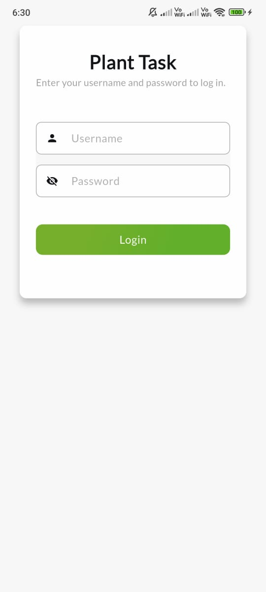
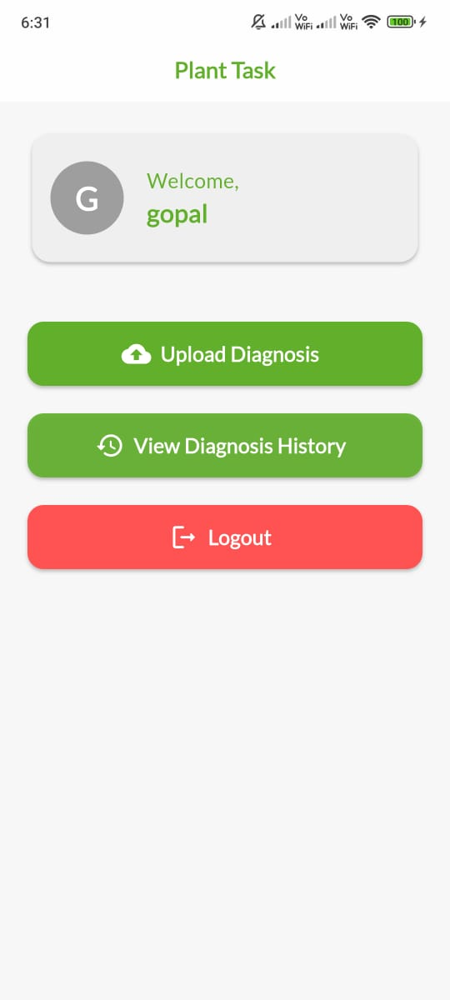
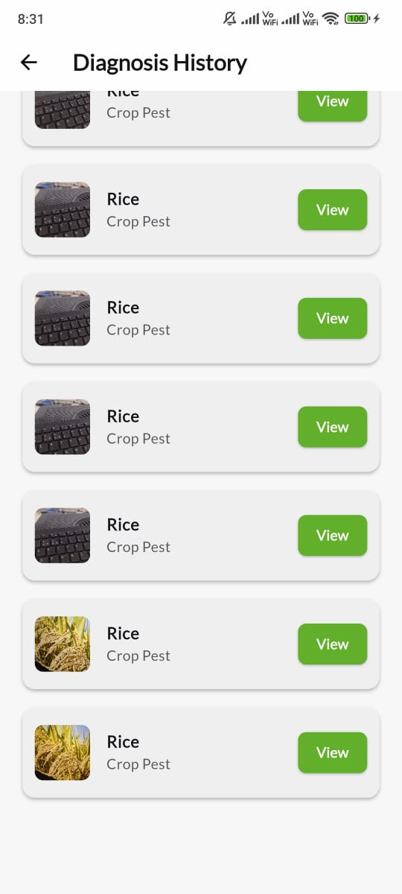

# frontend-plant-task

## Getting Started

### 1. Install Flutter

Follow the official Flutter installation guide:  
[Flutter Install Documentation](https://docs.flutter.dev/get-started/install)

Or run:

```bash
# macOS/Linux
git clone https://github.com/flutter/flutter.git -b stable
export PATH="$PATH:`pwd`/flutter/bin"
flutter doctor
```

### 2. Update `baseUrl` in `helper/utils/constant.dart`

Open the file at `helper/utils/constant.dart` and update the `baseUrl` variable to your backend API endpoint:

```dart
// helper/utils/constant.dart
const String baseUrl = 'https://your-api-url.com/';
```

### 3. Example Screenshots

Below are example screenshots of the application:

| Login Page | Home Page |
|------------|-----------|
|  |  |

| Upload Diagnosis | Recommendations | Diagnosis History |
|------------------|-----------------|------------------|
|  |  |  |